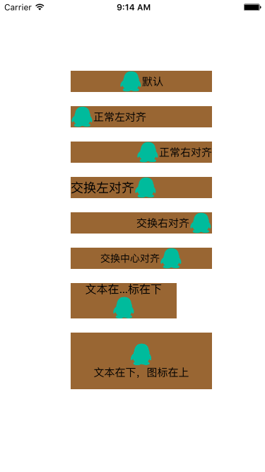
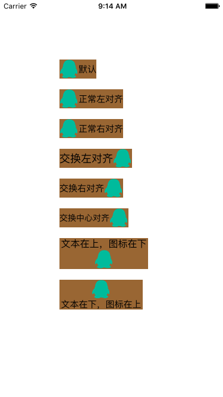

# ZSPositionButtonDemo
一句代码，直接调整Button内部Label和ImageView的位置

1. 创建ZSPositionButton
2. 给button一个位置属性


``` 
   ZSPositionButton *button = [ZSPositionButton buttonWithType:UIButtonTypeCustom];
    button.frame = frame;
    [button setBackgroundColor:[UIColor brownColor]];
    [button setImage:[UIImage imageNamed:@"image"] forState:UIControlStateNormal];
    [button setTitle:title forState:UIControlStateNormal];
    [button setTitleColor:[UIColor blackColor] forState:UIControlStateNormal];
    button.titleLabel.font = [UIFont systemFontOfSize:fontSize];
    button.positionType = positionType;//位置属性
    [self.view addSubview:button];
  
```



3. 添加 后效果，适应内容

```
[button sizeToFit];
```


